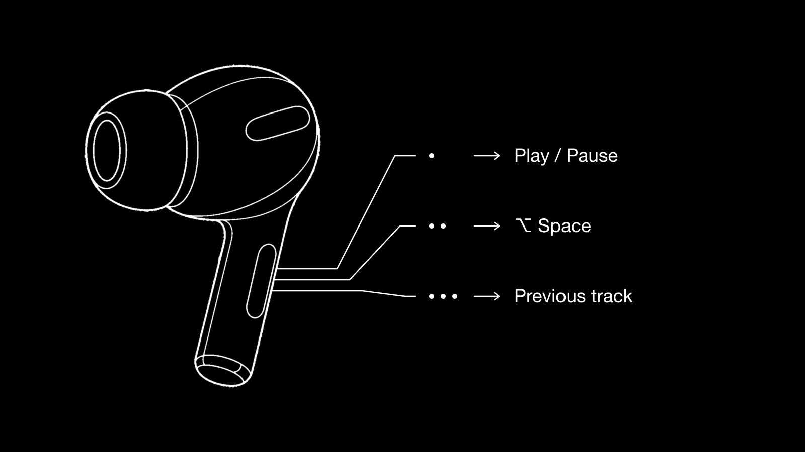
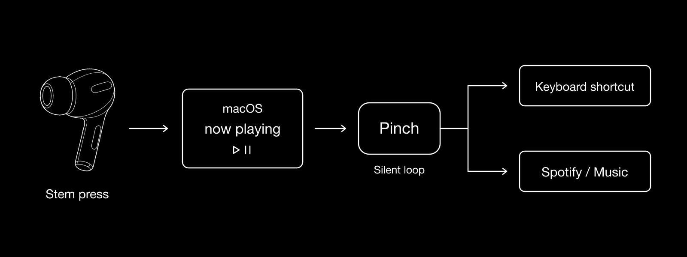

<p align="center">
  
</p>

<h1 align="center">Pinch</h1>

<p align="center">Turn AirPods stem presses into keyboard shortcuts on your Mac.</p>



## Install

1. Download the latest `Pinch-x.y.z.zip` from [Releases](https://github.com/RainnWorks/pinch/releases) and unzip it.
2. Move `Pinch.app` to Applications and open it.
3. macOS asks you to allow Pinch under **Privacy & Security → Accessibility**. Turn it on, then quit Pinch and open it again. Pinch needs this to send key presses.

Pinch needs macOS 14 or later.

## Use

Pinch sits in the menu bar and the Dock. Open **Settings** from either one, or press ⌘,.

Pick an action for each press:

| Press | Default | Options |
|---|---|---|
| Single | Play / Pause | Music, a shortcut, or nothing |
| Double | ⌥ Space | Music, a shortcut, or nothing |
| Triple | Previous track | Music, a shortcut, or nothing |

To set a shortcut, choose **Shortcut**, click the button, then type the keys. Esc cancels.

**Music** passes the press on to Spotify, or to Music if Spotify is not open. The first time, macOS asks you to allow Pinch to control that app.

The menu bar menu lists the last 15 presses and what Pinch did with each one.

## How it works



AirPods do not act as a keyboard. macOS sends each stem press to whichever app is "now playing", so key remappers such as Karabiner never see it.

Pinch plays silent audio to become the now playing app, and then receives the presses itself. When a press is set to **Music**, Pinch sends it on to Spotify or Music, and one second later takes the now playing slot back.

## Limits

- **Both buds do the same thing.** The AirPods do report which bud you pressed, but macOS gives that only to Apple's own software.
- **Press and hold is not available.** macOS keeps it for noise control and Siri.
- **Another media app can take the presses.** If Spotify or Music starts playing by itself, choose **Reclaim now playing** from the menu.
- **The silent audio keeps the AirPods connected to the Mac.** This uses a little AirPods battery, and the AirPods switch less readily to your iPhone.

## Build from source

```sh
./build.sh
open Pinch.app
```

This makes an ad-hoc signed build. macOS treats each rebuild as a new app, so you must allow Accessibility again after each one.

A signed and notarized release build needs a Developer ID Application certificate and a `notarytool` profile:

```sh
xcrun notarytool store-credentials pinch-notary
IDENTITY="Developer ID Application: <name> (<team id>)" ./release.sh
```

The zip lands in `dist/`.
